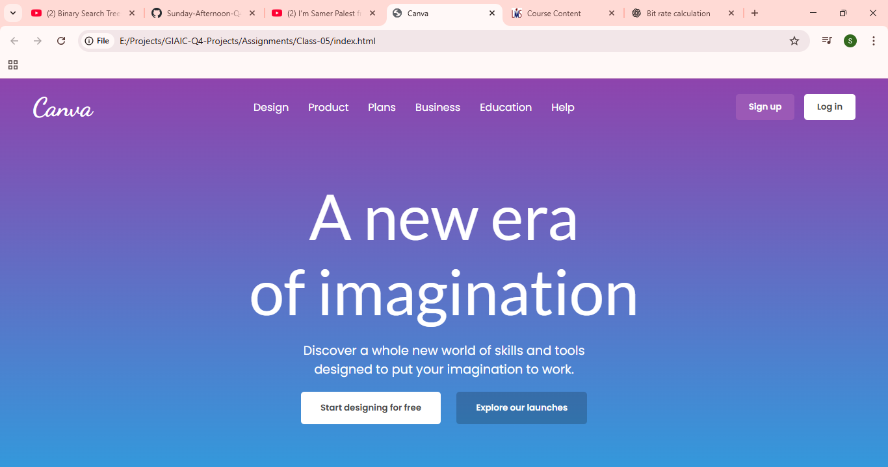

# Image to Code (Using Gemini CLI)

This assignment converts a webpage screenshot into HTML and CSS using Gemini CLI.

## Screenshot

## Task
Using Gemini CLI, generate the HTML and CSS of the given webpage screenshot.  
The layout, colors, spacing, and text should match the screenshot as closely as possible.

## Steps
1. Install and set up Gemini CLI.
2. Use the screenshot `Web_ss.png` as input.
3. Ask Gemini CLI to generate:
   - `index.html`
   - `style.css`
4. Output should match the UI of the screenshot.

## Output Files
- index.html  
- style.css
