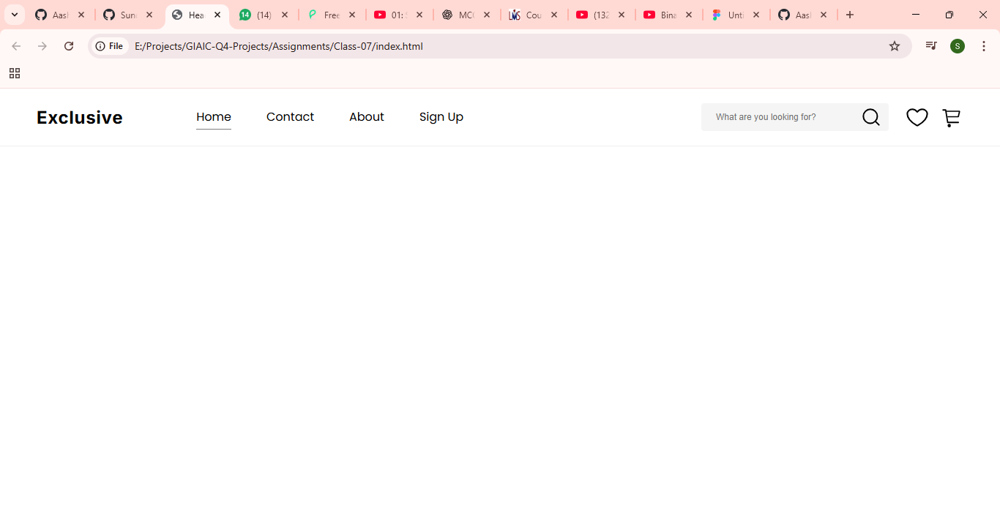

# Project-7: Figma to Code with Gemini CLI

A webpage header automatically generated from a Figma design using Gemini CLI. The MCP Server fetches the design context from Figma, and Gemini CLI converts it into HTML and CSS.

---

## 📌 Features

* Automated design-to-code workflow.
* Accurate replication of Figma header designs.
* Uses modern web standards (HTML5, CSS3) and Google Fonts.
* Easy to modify or extend after generation.

---

## 🛠 Technologies Used

* **Figma** – Source design tool.
* **Gemini CLI** – Automates code generation from design.
* **MCP Server** – Fetches structured design data from Figma.
* **HTML & CSS** – Generated markup and styles for the webpage.
* **Google Fonts** – “Inter” and “Poppins” for typography.

---

## ⚙ How It Works

1. Provide a Figma design link to Gemini CLI.
2. Gemini CLI communicates with the MCP Server to fetch design data.
3. The CLI generates `index.html` and `style.css` based on the design.
4. Assets (SVGs) are stored in the `assets/` folder for use in the header.

> **Note:** Editing the generated HTML or CSS may be overwritten if Gemini CLI is run again.

---

## 📂 Project Structure

```
Project-7/
│
├─ index.html        # Main HTML file (header markup)
├─ style.css         # Generated CSS for styling
├─ assets/           # SVG images and icons used in the header
└─ .gemini/          # Metadata used by Gemini CLI
```

---

## ⚡ Gemini CLI Commands

### Connect Figma MCP Server

```bash
gemini mcp add --transport http figma https://mcp.figma.com/mcp --header "Authorization: Bearer YOUR_TOKEN_HERE"
```

*Replace `YOUR_TOKEN_HERE` with your Figma Personal Access Token.*

### Verify Connection

```bash
gemini mcp list
```

### Generate HTML/CSS from Figma

```bash
gemini "Get the design context from [PASTE_YOUR_FIGMA_LINK] and generate HTML and CSS"
```

### Optional: React Component with Tailwind CSS

```bash
gemini "Get design context from [YOUR_LINK] and generate React components with Tailwind CSS"
```

### Optional: Responsive HTML/CSS

```bash
gemini "Use get_design_context on [YOUR_LINK] and create mobile-responsive HTML and CSS"
```

---

## 📷 Preview



---

## 💡 Tips & Best Practices

* Be specific with Gemini prompts (framework, responsive, accessibility).
* Start with one frame at a time to ensure accurate results.
* Save your generated code to files for easy access.
* Use `gemini mcp remove figma` and re-add if connections fail.

---

## 📝 Summary Checklist

* [ ] Install Gemini CLI
* [ ] Create Figma PAT token
* [ ] Connect Figma to Gemini: `gemini mcp add`
* [ ] Verify connection: `gemini mcp list`
* [ ] Share Figma file publicly
* [ ] Copy frame link from Figma
* [ ] Run Gemini CLI to generate code
* [ ] Save/use your generated code
